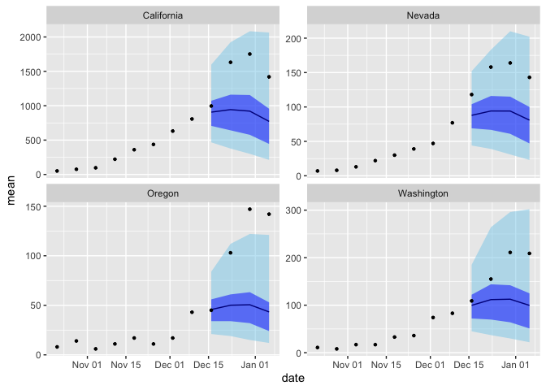

Code for: An accurate hierarchical model to forecast diverse seasonal
infectious diseases
================

This repository contains code to reproduce all materials for the paper
“An accurate hierarchical model to forecast diverse seasonal infectious
diseases” by Case, Salcedo & Fox.

Scripts for running all the analyses and figures are contained in the
`scripts` folder, while core functions for processing data, fitting the
model, and making predictions are contained in the `src` folder.

## Summary

The core of the forecasting functionality is separated into four source
files:

- `prep-fit-data.R`: take the observed target data and prepare it for
  model fitting and making forecasts. Does some basic formatting as well
  as produce `NA` observations for the forecast dates. Also contains
  some helper functions for producing neighbor matrices from areal
  shapefiles
- `model-formulas.R`: provides an interface for switching between
  several variants of the model by choosing different options for the
  season, short-term main, and short-term interaction effects
- `fit-inla-model.R`: function to fit the model using the workhorse
  function `inla`. Contains options to calibrate prediction uncertainty
  and to produce forecasts only for certain locations/horizons
- `sample-forecasts.R`: code to produce forecasts from a fitted model.
  To ensure accurate representation of the model’s predictions,
  forecasts are produced by sampling from the complete joint
  distribution over all locations and forecast horizons. Also contains
  code to produce aggregate (i.e. national) predictions and to summarize
  sampled forecasts into quantile format.

## Data format

The functionality currently assumes input data in “long” format,
containing columns `location`, `date`, `epiweek`. The column containing
the response/target data can be sepecified (default is `count`).
Additionally, an offset term is used in the model to control for
population size, so a column such as `population` containing the size of
each location or group should be included. You can set this to 1
throughout if you don’t know the population.

**Note that currently the framework is not fully generalized, and some
minor changes to the code would be required to work with a new
dataset.** Most of these would probably be in `prep-fit-data.R`.

## Forecasting example

``` r
library(tidyverse)
library(INLA)
library(lubridate)

source("src/prep-fit-data.R")
source("src/model-formulas.R")
source("src/fit-inla-model.R")
source("src/sample-forecasts.R")

inla.setOption(inla.mode="classic")
```

``` r
flu <- read_csv("data/weekly-flu-us.csv") |> 
    filter(date >= "2021-09-01") # exclude peak COVID-19 period
```

    ## Rows: 9752 Columns: 7
    ## ── Column specification ────────────────────────────────────────────────────────
    ## Delimiter: ","
    ## chr  (1): location
    ## dbl  (5): epiweek, epiyear, population, count, weekly_rate
    ## date (1): date
    ## 
    ## ℹ Use `spec()` to retrieve the full column specification for this data.
    ## ℹ Specify the column types or set `show_col_types = FALSE` to quiet this message.

``` r
forecast_date <- ymd("2023-12-15") # final date to include in training

# load up a spatial sf object of the US states and convert to neighborhood matrix
graph <- load_us_graph(flu) |> sf2mat()
```

    ## Warning in poly2nb(sf_graph): some observations have no neighbours;
    ## if this seems unexpected, try increasing the snap argument.

    ## Warning in poly2nb(sf_graph): neighbour object has 4 sub-graphs;
    ## if this sub-graph count seems unexpected, try increasing the snap argument.

``` r
fit_df <- flu |> 
    filter(location != "US") |> 
    prep_fit_data(forecast_date, weeks_ahead=4, ex_lam=population)

model <- model_formula(seasonal="shared", temporal="ar1", spatial="besagproper")

fit <- fit_inla_model(fit_df, model, graph=graph)
```

    ## [1] "forecast_date and pred_idx both NULL. This may have unexpected effects if there are NAs in fit_df prior to when forecasting should begin, but is otherwise fine."

``` r
pred_samp <- forecast_samples(fit_df, fit, nsamp=1000)
    
pred_summ <- pred_samp |> 
    summarize_quantiles() |> 
    pivot_wider(names_from=quantile) # wide format for ribbon plots
```

Plot the results compared to truth data:

``` r
# subset of flu data to compare with forecasts
loc_sub <- c("California", "Oregon", "Washington", "Nevada")

flu_sub <- filter(
    flu, 
    date >= (forecast_date - weeks(8)),
    date <= (forecast_date + weeks(4)),
    location %in% loc_sub
)

pred_summ |> 
    filter(location %in% loc_sub) |> 
    ggplot(aes(date)) +
    geom_ribbon(aes(ymin=`0.025`, ymax=`0.975`), fill="skyblue", alpha=0.5, col=NA) +
    geom_ribbon(aes(ymin=`0.25`, ymax=`0.75`), fill="blue1", alpha=0.5, col=NA) +
    geom_line(aes(y=mean), col="blue4") +
    geom_point(aes(y=count), flu_sub, size=0.9) +
    facet_wrap(~location, scales="free_y")
```

<!-- -->

### Aggregating forecasts from the joint predictive distribution

Use function `aggregate_forecast` to aggregate forecasts over different
locations. By default, this function assumes all locations are to be
aggregated into a single group, but additional grouping variables can be
passed to produce e.g. regional forecasts instead. In this example, just
want national forecasts, i.e. an unweighted sum over all states’
predictions.

The optional `tags` argument can be used to label these aggregate
forecasts

``` r
pred_samp_us <- aggregate_forecast(pred_samp, tags=tibble_row(location="US"))
```

The national predictions can simply be added to the state predictions,
before or after summarizing, to produce national quantile forecasts:

``` r
pred_samp |> 
    bind_rows(pred_samp_us) |> 
    summarize_quantiles()
```

    ## # A tibble: 1,060 × 6
    ##    date       location horizon  mean quantile value
    ##    <date>     <chr>      <int> <dbl>    <dbl> <dbl>
    ##  1 2023-12-16 Alabama        1 125.     0.025  63  
    ##  2 2023-12-16 Alabama        1 125.     0.25   97  
    ##  3 2023-12-16 Alabama        1 125.     0.5   121  
    ##  4 2023-12-16 Alabama        1 125.     0.75  148  
    ##  5 2023-12-16 Alabama        1 125.     0.975 216. 
    ##  6 2023-12-16 Alaska         1  19.6    0.025   5  
    ##  7 2023-12-16 Alaska         1  19.6    0.25   12  
    ##  8 2023-12-16 Alaska         1  19.6    0.5    17  
    ##  9 2023-12-16 Alaska         1  19.6    0.75   24  
    ## 10 2023-12-16 Alaska         1  19.6    0.975  48.0
    ## # ℹ 1,050 more rows

The function can also produce totals while removing certain
locations/groups by adding new groups to the data. For example, to
produce total predictions for just the continental US:

``` r
outside_loc <- c("Alaska", "Hawaii", "Puerto Rico")

aggregate_forecast(pred_samp, is_continental=!(location %in% outside_loc)) |> 
    filter(is_continental)
```

    ## # A tibble: 4 × 5
    ##   date       horizon is_continental location predicted    
    ##   <date>       <int> <lgl>          <chr>    <list>       
    ## 1 2023-12-16       1 TRUE           All      <int [1,000]>
    ## 2 2023-12-23       2 TRUE           All      <int [1,000]>
    ## 3 2023-12-30       3 TRUE           All      <int [1,000]>
    ## 4 2024-01-06       4 TRUE           All      <int [1,000]>
