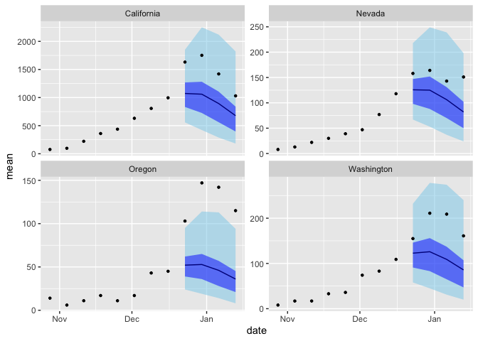

inla-forecasting-paper
================

## Summary

The core of the forecasting functionality is separated into four source
files:

- `prep-fit-data.R`: take the observed target data and prepare it for
  model fitting and making forecasts. Does some basic formatting as well
  as produce `NA` observations for the forecast dates. Also contains
  some helper functions for producing neighbor matrices from areal
  shapefiles
- `model-formulas.R`: provides an interface for switching between
  several variants of the model by choosing different options for the
  season, short-term main, and short-term interaction effects
- `fit-inla-model.R`: function to fit the model using the workhorse
  function `inla`. Contains options to calibrate prediction uncertainty
  and to produce forecasts only for certain locations/horizons
- `sample-forecasts.R`: code to produce forecasts from a fitted model.
  To ensure accurate representation of the model’s predictions,
  forecasts are produced by sampling from the complete joint
  distribution over all locations and forecast horizons. Also contains
  code to produce aggregate (i.e. national) predictions and to summarize
  sampled forecasts into quantile format.

## Data format

The functionality currently assumes input data in “long” format,
containing columns `location`, `date`, `epiweek`, and `count` (the
target data). Additionally, an offset term is used in the model to
control for population size, so a column such as `population` containing
the size of each location or group should be included.

**Note that currently the framework is not fully generalized, and some
minor changes to the code would be required to work with a new
dataset.** Most of these would probably be in `prep-fit-data.R`.

## Forecasting example

``` r
library(tidyverse)
library(INLA)
library(lubridate)

source("src/prep-fit-data.R")
source("src/model-formulas.R")
source("src/fit-inla-model.R")
source("src/sample-forecasts.R")

inla.setOption(inla.mode="classic")
```

``` r
flu <- read_csv("data/weekly-flu-us.csv") |> 
    filter(date >= "2021-09-01") # exclude peak COVID-19 period
```

    ## Rows: 9752 Columns: 7
    ## ── Column specification ────────────────────────────────────────────────────────
    ## Delimiter: ","
    ## chr  (1): location
    ## dbl  (5): epiweek, epiyear, population, count, weekly_rate
    ## date (1): date
    ## 
    ## ℹ Use `spec()` to retrieve the full column specification for this data.
    ## ℹ Specify the column types or set `show_col_types = FALSE` to quiet this message.

``` r
forecast_date <- ymd("2023-12-07") # first date where forecasting will begin

# load up a spatial sf object of the US states and convert to neighborhood matrix
graph <- load_us_graph(flu) |> sf2mat()

fit_df <- flu |> 
    filter(date < forecast_date) |> # pretend we only have data before `forecast_date`
    prep_fit_data_flu_covid(weeks_ahead=4, ex_lam=population)

model <- model_formula(seasonal="shared", temporal="ar1", spatial="besagproper")

fit <- fit_inla_model(fit_df, forecast_date, model, graph=graph)
```

    ## Warning in inla.model.properties.generic(inla.trim.family(model), mm[names(mm) == : Model 'besagproper' in section 'latent' is marked as 'experimental'; changes may appear at any time.
    ##   Use this model with extra care!!! Further warnings are disabled.

    ## Warning in .recacheSubclasses(def@className, def, env): undefined subclass
    ## "ndiMatrix" of class "replValueSp"; definition not updated

``` r
pred_summ <- sample_count_predictions(fit_df, fit, forecast_date, nsamp=5000) |> 
    summarize_quantiles() |> 
    pivot_wider(names_from=quantile) # wide format for ribbon plots

# subset of flu data to compare with forecasts
loc_sub <- c("California", "Oregon", "Washington", "Nevada")

flu_sub <- filter(
    flu, 
    date >= (forecast_date - weeks(8)),
    date <= (forecast_date + weeks(4)),
    location %in% loc_sub
)

pred_summ |> 
    filter(location %in% loc_sub) |> 
    ggplot(aes(date)) +
    geom_ribbon(aes(ymin=`0.025`, ymax=`0.975`), fill="skyblue", alpha=0.5, col=NA) +
    geom_ribbon(aes(ymin=`0.25`, ymax=`0.75`), fill="blue1", alpha=0.5, col=NA) +
    geom_line(aes(y=mean), col="blue4") +
    geom_point(aes(y=count), flu_sub, size=0.9) +
    facet_wrap(~location, scales="free_y")
```

<!-- -->
